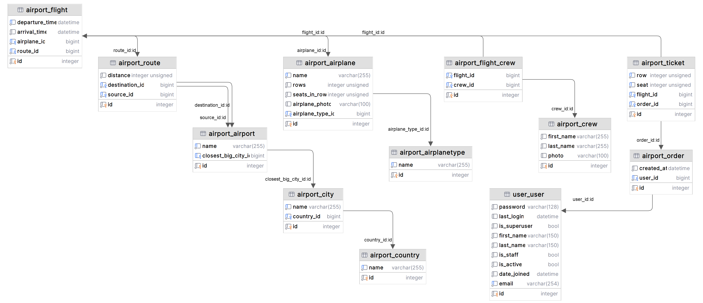
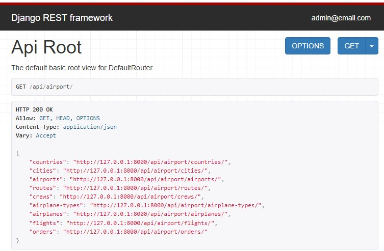
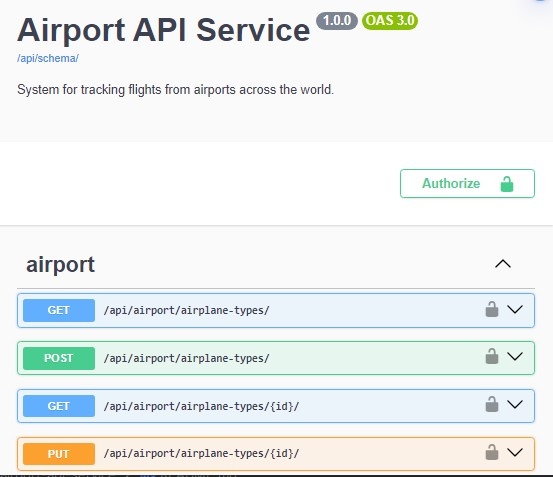

# Airport API Service Project

System for managing airplanes, flights, crew, tickets orders and airports using DRF. 

It allows to easy book tickets for trips using airplanes. 

This system is for tracking flights from airports across the whole globe.

___

### Database Structure:


### Features:

- JWT Authentication
- Admin panel: /admin/
- Documentation at: /api/schema/swagger-ui/
- Managing Orders and Tickets for flights
- Creating & managing Airports with Cities, Countries
- Creating & managing Airplanes with Airplane Types & with images
- Creating & managing Crew with photo images
- Creating Routes with Airports
- Creating Flights with routes, crews, airplanes
- Filtering Routes and Flights by source and destination & date ranges 

- Administrators have access to CRUD operations for all entities. 
- Users can create Orders with Tickets for Flights & take a list of filtering flights.

___
### Installation using GitHub 

System requirements:

* **Python 3.12+ (need to be installed)**
* Django 5.+ & Django Rest Framework 3.+ (will be install automatically )


1. Clone GitHub repository:
```
https://github.com/u123dev/airport-api-service.git
```
  - You can get the link by clicking the `Clone or download` button in your repo

2. Open the project folder in your IDE

or 
```
cd airport-api-service
```
3. Make virtual environment and install requirements in it:
```
py -m venv venv
venv\Scripts\activate (on Windows)
# or
source venv/bin/activate (on macOS)
pip install -r requirements.txt
```
4. DATABASE:
- a) You need to Install **PostgreSQL**

Create environment variables: 
```
set POSTGRES_DB = <db name>
set POSTGRES_USER = <db username>
set POSTGRES_PASSWORD = <db user password>
set POSTGRES_HOST = <db host>
set POSTGRES_PORT = <db port>
```
or 
- b) You can use built-in SQlite by default

5. Migrate & make database:
```
py manage.py migrate
```
5. Load demo data from fixture:
```
py manage.py loaddata data.json
```
6. After loading demo data you can use test user:
  - Login: `admin@email.com`
  - Password: `admin`
7. Run project:
```
py manage.py runserver
```
8. Access Airplane API Service in your browser: [http://127.0.0.1:8000/api/airport/](http://127.0.0.1:8000/api/airport/)

---

### Run with Docker 
 System requirements:

* **Docker Desktop 4.+**

Run project:
```
docker-compose up --build
```

### Getting access
1. Test admin user:

- Email: admin@email.com
- Password: 1qazcde3

2. Register new user:
- **api/user/register/** 

3. Obtain pair an access authentication & refresh tokens by sending a POST user credentials - email(as login) & password: 
- **api/user/token/** 

4. Header to access endpoints:
- **Authorization: Bearer *< Access Token >***

### Documentation 
 
Swagger via:
- **api/schema/swagger-ui/** 

Redoc via:
- **api/doc/redoc/**

### Demo




### Contact
Feel free to contact: u123@ua.fm
